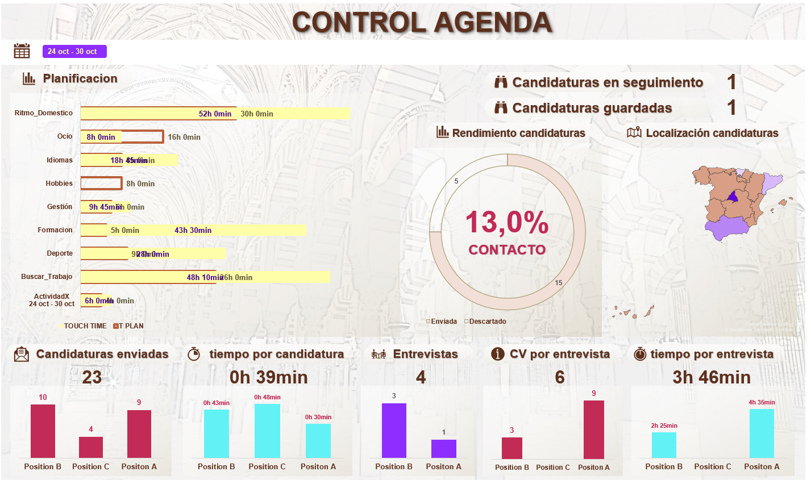
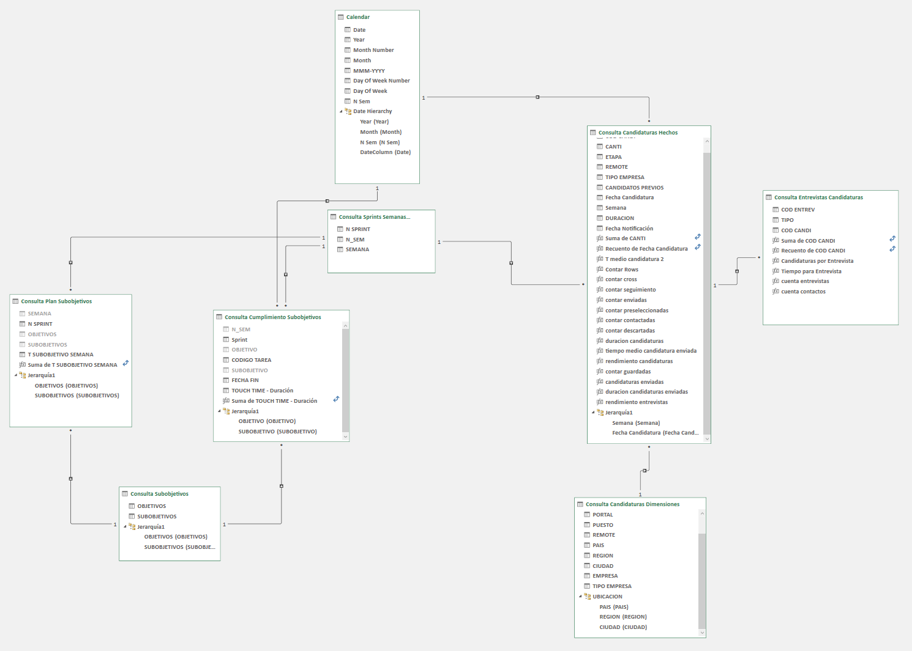
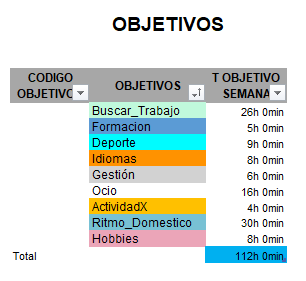
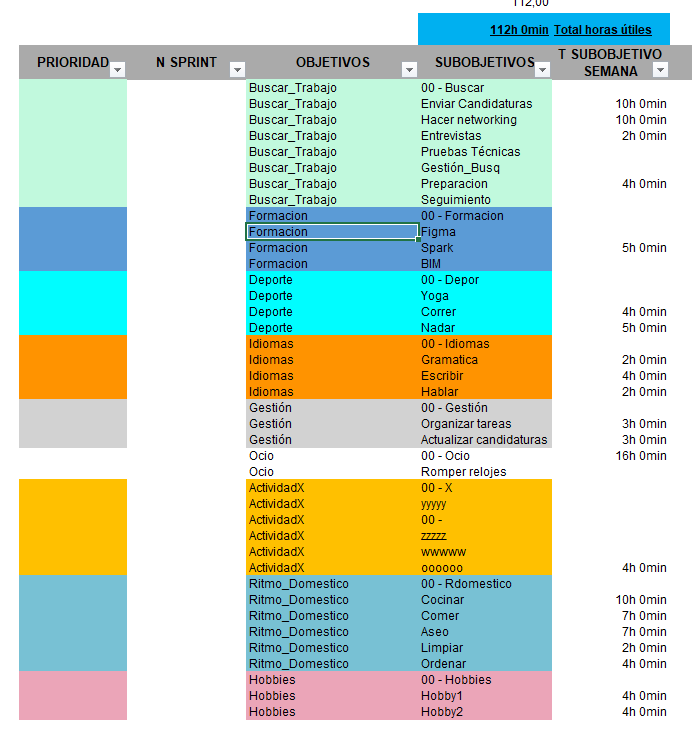
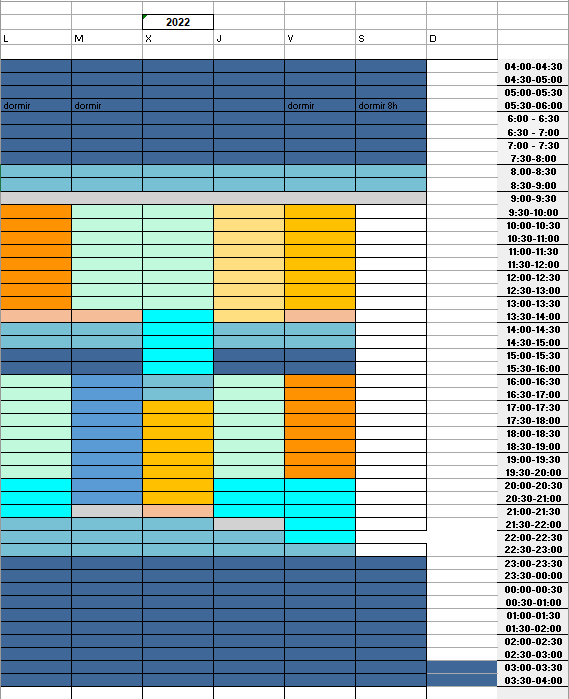
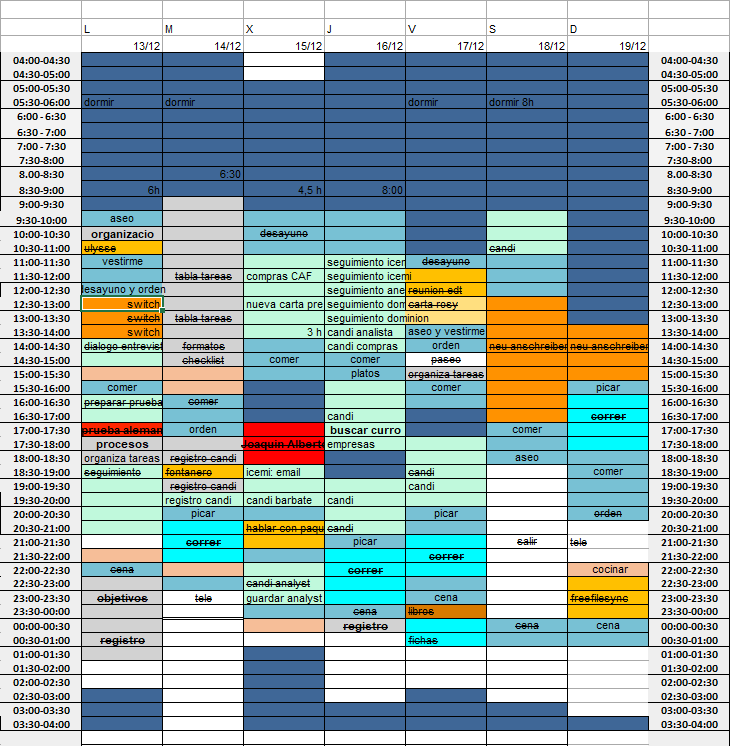

# JOB CLERK

### CONTENTS
	
* [INTRODUCCION](https://github.com/aldamepi/jobClerk/new/main#introduccion)	
  + [AVISOS Y CONSEJOS PRINCIPALES](https://github.com/aldamepi/jobClerk/new/main#avisos-y-consejos-principales)
* [MISION](https://github.com/aldamepi/jobClerk/new/main#mision)	
* [VISION](https://github.com/aldamepi/jobClerk/new/main#vision)	
* [FRAMEWORK](https://github.com/aldamepi/jobClerk/new/main#framework)	 
[GESTION DEL TIEMPO](https://github.com/aldamepi/jobClerk/new/main#gestion-del-tiempo)  
* [OBJETIVOS SEMANALES](https://github.com/aldamepi/jobClerk/new/main#objetivos-semanales)
  + [OBJETIVOS Y SUBOJETIVOS](https://github.com/aldamepi/jobClerk/new/main#objetivos-y-subobjetivos)
  + [DEFINICION DEL SPRINT](https://github.com/aldamepi/jobClerk/new/main#definicion-del-sprint)
    + USO
    + MACRO ACTUALIZAR SUBOBJETIVOS
  + [REGISTRO DE SPRINTS](https://github.com/aldamepi/jobClerk/new/main#registro-de-sprints)
    + MACRO REGISTRA SPRINT
* [TIMING - AGENDA](https://github.com/aldamepi/jobClerk/new/main#timing---agenda)	
* [TAREAS - SPRINT CONTINUO](https://github.com/aldamepi/jobClerk/new/main#tareas---sprint-continuo)	
  + USO  
[BUSQUEDA DE EMPLEO](https://github.com/aldamepi/jobClerk/new/main#busqueda-de-empleo)  
* [CANDIDATURAS](https://github.com/aldamepi/jobClerk/new/main#candidaturas)	
  + USO
* [ENTREVISTAS](https://github.com/aldamepi/jobClerk/new/main#entrevistas)	
  + USO
* [PROXIMOS PASOS](https://github.com/aldamepi/jobClerk/new/main#proximos-pasos)	
* [RECONOCIMIENTOS](https://github.com/aldamepi/jobClerk/new/main#reconocimientos)	

### INTRODUCCION
Base de datos sobre excel con dos funcionalidades principales:
* Gestión de tiempo: permitir la definición, organización y control de un horario en intervalos semanales en base a conceptos agile y project management.
* Asistente de búsqueda de empleo: Análisis gráfico interactivo que permite controlar el tiempo dedicado a la búsqueda de empleo determinando entre otras métricas el tiempo medio necesario para conseguir una entrevista según los tipos de puestos aplicados. Usa un registro de las candidaturas enviadas y las entrevistas realizadas que se puede usar para organizar el seguimiento de las mismas.

### AVISOS Y CONSEJOS PRINCIPALES
Estos son los consejos más generales, en caso de dudas o para comprender el funcionamiento de las macros leer el resto de la documentación.
* No se han ocultado las pestañas de uso interno o que son base del cálculo. Se recomiendo no modificar el contenido de las mismas a nivel de usuario. En cualquier caso guardar los cambios antes de modificar las mismas para evitar la perdida de información y funcionalidad.
* Las pestañas para introducir información y que se pueden modificar son las coloreadas.
* Se recomienda no cambiar los nombres de las tablas de las columnas a un nivel usuario. Esto puede ocasionar fallos en la actualización del dashboard y el calculo de las métricas ya que puede eliminar relaciones entre las consultas de la base de datos o invalidar el calculo de métricas. En cualquier caso guardar los cambios antes de modificar las mismas para evitar la perdida de información y funcionalidad.
* Se recomienda el uso de shortcuts para introducir las fechas y horas actuales en la tabla tareas.
* La cinta de opciones de excel no se actualiza al cambiar el nombre del archivo. Las macros de la cinta de opciones quedaran inutilizadas hasta que se actualicen en la configuración. En todo caso las macros se pueden seguir ejecutando desde la ventana macros.  

Ante cualquier duda o sugerencia de mejorar no dudar contactar conmigo directamente por cualquier medio. Por ejemplo, haciendo un comentario en el commit de GitHub, por LinkedIn o por email.

### MISION
La misión de Job Clerk es proporcionar una herramienta integral de planificación, organización y control de horarios y de búsqueda de empleo según conceptos de project management o agile. Ofreciendo métricas y gráficos de la consecución de los objetivos.

* Control del tiempo planificado y dedicado a cada uno de nuestros objetivos.
* Numero de candidaturas en seguimientos.
* Numero de candidaturas guardadas.
* Resumen de los resultados de las candidaturas enviadas.
* Mapa de localización de las candidaturas enviadas.
* Candidaturas enviadas por tipo de vacante.
* Tiempo medio dedicado a cada candidatura.
* Entrevistas conseguidas por cada tipo de vacante.
* Numero de candidaturas enviadas para conseguir una entrevista.
* Tiempo necesario para conseguir una entrevista.

### VISION
¿Te encuentras en búsqueda activa de empleo? ¿Estás enviando una cantidad elevada de candidaturas cada semana a diferentes tipos de puestos, empresas y localizaciones geográficas? ¿Crees que hay pasos que no estás teniendo en cuenta? ¿O simplemente que el rendimiento de tu búsqueda puede mejorar?  
¡Esta herramienta es para ti!  
Con ella podrás tener un registro completo de todos los puestos a los que aplicas. Pero no sólo eso: 
* podrás clasificar las diferentes vacantes según tus preferencias y el estado en el que se encuentran el proceso de selección
* Podrás ver automáticamente un reporte visual actualizado de tu actividad que incluye entre otras cosas: 
  + El número de candidaturas enviadas por cada tipo de puesto, 
  + cuales son las ubicaciones donde encuentras un mayor numero de oportunidades 
  + y el tiempo necesario que tienes que dedicar a tu búsqueda de empleo cada semana para conseguir una entrevista exitosa.  

¿Entusiasmado? Espera un momento porque aún hay más.  
¿A parte de buscar trabajo, tienes otras muchas cosas que hacer a lo largo del día? ¿Estás trabajando en una startup que será el próximo unicornio que acabe con los problemas de la humanidad? ¿Aún estás terminando de leer el Quijote? ¿Te estás preparando para las próximas olimpiadas de invierno? ¿Estás ayudando a tus hijos para que sean presidentes del gobierno cuando crezcan? ¿No encuentras un momento para volver a pintar la cubierta de tu barco después de la fiesta loca de anoche? ¿El reactor de tu nave espacial hace un ruido raro y tienes que revisar la velocidad de híper espacio?… Bueno, estos parece que no son los mejores ejemplos pero ¡¿te gusta exprimir tu tiempo al máximo de acuerdo con tus prioridades?!  
¡Definitivamente esta herramienta es para ti!
Con jobclerk ademas podrás tener el control del tiempo que dedicas a cada una de tus actividades:
* Define y estructura tus objetivos
* Organiza tus tareas como un project manager
* Distribuye y organiza tu agenda de acuerdo a tus prioridades
* Registra a que dedicas tu tiempo efectivamente
* Obtén un informe gráfico de manera automática para comprobar fácilmente a que dedicas tu tiempo a lo largo de la semana, compararlo con tus objetivos y poder tomar medidas correctivas si es necesario.

Y lo más importante, no olvides descansar lo suficiente y celebrar cuando logras tus éxitos ;)

### FRAMEWORK
Jobclerk es una plantilla que funciona como una base de datos en excel. Tiene macros en VBA que permiten agilizar la realización de tareas complejas para el manejo de base de datos como la actualización automática de queries en Power Query, con código M. Mediante Power Pivot se define un diagrama de base de datos en estrella y una seria de métricas y KPIs con formulas DAX que se actualizan automáticamente para mantener un reporte visual interactivo con gráficos avanzados.  
Contiene:
* 5 pestañas para introducción de datos:
  + Objetivos
  + Timing
  + Tareas
  + Candidaturas
  + Entrevistas
* 1 dashboard
  + CONTROL
* 5 pestañas para uso interno que sirven de soporte a las queries:
  + Reg Sprints
  + Listas Q
  + ListsA
  + ListsI
  + Semanas: Es la base de los cálculos temporales, se crea a partir de la primera fila de la tabla introduciendo la fecha inicial.
* 9 pestañas con tablas dinámicas para soportar el dashboard:
  + TD plan
  + TD SumCant
  + TD tCan
  + TD Ent
  + TD CandEnt
  + TD tEnt
  + TD seg
  + TD rend
  + TD ubic
* Macros:
  + actualizar_subobjetivos
  + RegistraSprint
  + InsertarFila

__ATENCION:__ Si se __cambia el nombre del archivo__ es necesario actualizar el vinculo de la cinta de opciones a las macros, en caso contrario los botones de la cinta de opciones no funcionaran. Siempre se pueden ejecutar los macros desde la ventana macros.
* Queries:
  + Generadas automáticamente con la macros para coordinar la funcionalidad de los objetivos y subjetivos en las listas de validación de la tabla de tareas
  + 7 queries que fundamentan el diagrama en estrella en power Pivot
* Power Pivot:

  + 9 relaciones entre queries y tablas
  + Más de 25 medidas para incorporarlas en las tablas dinámicas que dan soporte al dashboard
## GESTION DEL TIEMPO
### OBJETIVOS SEMANALES
Nos encontramos en la pestaña “Objetivos”.   
El objetivos de esta pestaña es organizar y estructurar el tiempo que le dedicamos a nuestras actividades a lo largo de una semana. Por lo que empezamos contando las horas del día y de la semana.
* Cada día tiene 24 h
* Suponemos que todos los días dormimos 8 h (al menos en la elaboración de los objetivos)
* Nos quedan 112 h de vida semanales a repartir en cada una nuestras actividades
#### OBJETIVOS Y SUBOJETIVOS
Nos permite agrupar las tareas por categorias y subcategorias que apareceran gráficamente en el dashboard.  
Los objetivos y los subobjetivos son las categorías y subcategorías en las que podemos clasificar cada una de las tareas que realizamos a lo largo de la semana.  
Se puede entender que los objetivos y subjetivos son aspectos de nuestra vida que persisten a lo largo del tiempo, dentro de los cuales podemos englobar el resto de tareas puntuales que realizamos. Además nos pueden servir para controlar si realmente dedicamos el tiempo a nuestras prioridades o por el contrario acabamos dedicando nuestro tiempo a tareas que en principio consideramos de menor prioridad.  
Por ejemplo, algunos objetivos pueden ser:
* Buscar trabajo
* Estudiar idiomas
* Tiempo libre

Algunos subobjetivos pueden ser:
* Buscar trabajo
* Actualizar CV
* Seguimiento de candidaturas pendientes
* Enviar candidaturas
* Hacer pruebas técnicas
* Estudiar idiomas
* Leer un libro
* Estudiar gramatica
* Escribir cartas
* Tiempo libre

(I would not plan my free time with that tool in detail, rather than checking that I am taking the necessary time to rest).  
Algunas tareas pueden ser:
* Participar en el casting la película ganadora del próximo Oscar
* Study chapter 6 of my English grammar book
* Call that wonderful recruiter who told me not to worry

#### DEFINICION DEL SPRINT
La forma de definir los objetivos y los subobjetivos está basada en la metodología agile y scrum.  
Se usa el concepto de sprint sólo para concretar el tiempo que se le dedica a cada uno de los objetivos y subobjetivos a lo largo de una semana. No se determinan las tareas que se realizan en cada sprint. Para gestionar las tareas hay otra pestaña llamada “Tareas”.  
Los sprints tienen una duración de una semana.
##### USO
Nos encontramos en la pestaña “Objetivos”
En la tabla objetivos se definen los distintos objetivos: buscar trabajo, estudiar idiomas, hacer deporte, etc.  
  
* OBJETIVOS: Introducimos nuestros objetivos. Indicar con una sola palabra, en todo caso dos palabras sin espacios y separadas por guion bajo _.
* T OBJETIVO SEMANA: Campo calculado. Es la suma de todos los tiempos de los subobjetivos indicados en la siguiente tabla.
* CODIGO OBJETIVO: no sirve para nada aún.

En la __tabla sprints__ se añaden los __subobjetivos__ que queramos para cada objetivo y el tiempo que le vamos a dedicar durante una semana.
En la tabla objetivos podemos observar el total de tiempo que se destinará a cada objetivo según el tiempo introducido en la tabla sprint.  
  
* PRIORIDAD: es opcional.
* N SPRINT es opcional. Conviene cambiarla cada vez modificamos el sprint para llevar la cuenta de las veces que predefinimos nuestras prioridades.
* OBJETIVOS: se repiten los objetivos tantas veces como haya subobjetivos para el mimo. Conviene que estén ordenados antes de registrar el sprint.
* Subobjetivos: un segundo nivel de clasificación de nuestras tareas cotidianas por debajo de los objetivos que nos ayundan a distribuir el tiempo que dedicamos a cada uno de ellos. Todos los subobjetivos que definamos en esta tabla podrán aparecer desglosados en el dashboard para comprobar la medida en la que estamos cumpliéndolos. Cada objetivo tiene por lo menos un subobjetivo 00 necesario para usar con las tareas que no podemos asignar a ningún subobjetivo definido hasta el momento.
* T SUBOBJETIVO SEMANA: tiempo a la semana que le vamos a dedicar a cada subobjetivo. Por lógica mientras más tiempo le dediquemos a un proyecto mayor prioridad tendrá para nosotros. Introducir según el formato hh:mm.
* OBSERVACIONES: Aclaraciones o comentarios que nos sirvan para comprender mejor los subobjetivos o nos ayuden a desarrollarlos mejor en el futuro.

__IMPORTANTE:__ Una vez definido habrá que ejecutar la macro “registrar sprint” para añadir el sprint a la serie temporal en la pestaña “Reg Sprints”.  
Para repetir el mismo patron de prioridades de tiempo para los objetivos y subobjetivos durante otra semana más no es necesario modificar el sprint, sólo ejecutar la macro la semana próxima y se volverá a llevar el mismo sprint a la pestaña registro de sprints.  
Cada objetivo tiene por lo menos un subobjetivo 00 necesario para usar con las tareas que no podemos asignar a ningún subobjetivo definido hasta el momento.

##### MACRO ACTUALIZAR SUBOBJETIVOS
Esta pestaña sirve de base, entre otras cosas, para la clasificación de tareas que se introducen en la pestaña “Tareas”.  
Cada vez que modifiquemos un sprint, __IMPORTANTE se debe ejecutar la macro “Actualizar Subobjetivos” para así tener actualizadas las listas desplegables de la pestaña “Tareas”.__  
Con el fin de poder seleccionar los objetivos y subobjetivos en las listas desplegables de la pestaña “Tareas” y asegurar la calidad de los datos.
#### REGISTRO DE SPRINTS
Nos encontramos en la pestaña “Reg Sprints”. Se trata de una pestaña de uso interno donde se registra una serie temporal de todos los objetivos y subobjetivos definidos en la pestaña “Objetivos”
##### MACRO REGISTRA SPRINT
La tabla “Registro Sprints” se rellena automaticamente con el uso de la macro “registra sprint” situada en la cinta de opciones “Mis Macros”. __Es necesario ejecutar la macro manualmente después de redefinir las prioridades de los objetivos de un sprint.__ Nos permitirá comparar el tiempo planificado a nuestros objetivos con el tiempo realmente dedicado.  
La unidad de tiempo de esta serie temporal son las semanas del año.

### TIMING - AGENDA
En la hoja “Timing” encontramos un calendario semanal: las semanas a lo largo del año.  
El calendario semanal se divide en filas y columnas. Cada fila representa media hora de tiempo y cada columna un día.  
En el calendario semanal puedes distribuir por un lado un modelo del sprint planificado en la hoja de objetivos. De esta forma puedes distribuir a lo largo de la semana las tareas por objetivos y planificar a que debes dedicar tu tiempo en cada momento según lo planificado.  
  
Por otro lado puedes ir rellenado en el calendario real en que ocupas tu tiempo, teniendo en cuenta las variaciones con respecto al plan inicial y los imprevistos. Para así tener un registro gráfico de lo que haces, poder analizarlo y tomar las medidas correctoras necesarias.  
  

### TAREAS - SPRINT CONTINUO
Estamos en la pestaña “Tareas”.  
La principal finalidad de esta pestaña es registrar las tareas pendientes que tenemos que realizar así como su prioridad y duración estimada para poder seleccionar con mayor criterio cual tarea realizar en cada momento.  
Una vez terminada una tarea, podemos introducir la fecha de finalización y la duración real de ejecución para poder obtener métricas de kanban, conocer mejor nuestro rendimiento y comprobar que nos estamos ajustando a los objetivos de nuestro plan gracias al dashboard.  
La estructura de esta pestaña está basada en conceptos de Agile Project Management, en particular Kanban. Y nos permite controlar métricas como:
* Límite WIP: pendiente de cálculo
* Lead Time
* Touch Time
* Cycle Time 

Nota: el calculo de estás métricas puede variar de la definición oficial o no estar automatizado.

#### USO
Los campos a rellenar son los siguientes:  
* ESTADO: Tiene un valor predeterminado de 0. Una vez completada una tarea introducir el valor 1. Automáticamente aparecerá la marca de tic y cambiar el formato de texto de la tarea a tachado. Nota: se recomienda ordenar periódicamente la tabla tareas según esta columna para mantener las tareas pendientes arriba.
* OBJETIVO: Seleccionar en la lista desplegable el objetivo introducido en la pestaña objetivos y registrado con la macro desglose subobjetivos.
* SUBOBJETIVOS: idem
* Sprint: Aqui registramos el numero del sprint en el cual realizamos una tarea. Opcional.
* CODIGO TAREA: Uso interno. Inhabil.
* Prioridad: En esta columna, a pesar de ser opcional, nos permite clasificar y ordenar nuestras tareas pendientes independientemente. 
* TAREA: Descripción de la tarea
* Fecha Entrada: Fecha de registro de la tarea en la tabla. Se recomienda usar shortcuts para introducir la fecha y hora actual.
* Duración estimada: Tiempo estimado que pensamos podemos dedicar en completar la tarea. Al principio supone un esfuerzo extra o incluso cierta creatividad pero con la práctica nos permitirá conocer mejor nuestro rendimiento y mejorar nuestra capacidad de organización.
* Fecha Fin: Rellenar cuando se completa una tarea. Esta fecha sirve de referencia para rellenar el dashboard y mantener un control actualizado de nuestro trabajo. Nos permitirá además calcular las métricas kanban. Se recomienda usar los shortcuts de excel para fecha y hora actuales.
* TOUCH TIME: Tiempo real usado para terminar una tarea. Permite controlar el tiempo que dedicamos a nuestros objetivos y subobjetivos así como compararlo con los tiempos planificados en el sprint. Se recomienda redondear a intervalos de 30 min y apoyarse en la pestaña Timing para mantener este control.
* Observaciones: Anotaciones adicionales sobre las tareas como relación con tareas anteriores o posteriores o posibles imprevistos durante su realización.
* LEAD TIME: Metrica Kanban. Es el intervalo de tiempo desde que se registra una tarea hasta que se termina.
* Tiempo de Espera: Metrica Kanban. Es el intervalo desde que se registra una tarea hasta que se empieza a realizar.
* N_SEM: Uso interno. No rellenar. Representa la semana del año en la que se finaliza una tarea. Sirve para completar el dashboard.

## BUSQUEDA DE EMPLEO

### CANDIDATURAS
Estamos en la pestaña “Candidaturas”. Está vinculada con la pestaña “ListasA” donde se encuentran las tablas que contienen los términos de las listas desplegables. De aquí obtendremos los datos necesarios para calcular las métricas mostradas en el dashboard CONTROL sobre el tiempo necesario para conseguir una entrevista o en los puestos en los que tenemos más éxito.  
En esta pestaña llevamos el registro principalmente de las candidaturas enviadas y también se pueden guardar las candidaturas guardadas para enviar más adelante.  
Tiene una doble funcionalidad. Tanto poder filtrar y ordenar en base a criterios de nuestra elección como tipo de puesto, tipo de empresa, ubicación. Como poder analizar el rendimiento de nuestra busqueda de empleo indicando el tiempo dedicado a enviar la candidatura, el portal en el que se publicó, la fecha de publicación o los candidatos previos.  

#### USO
Los campos de esta tabla son los siguientes:
* CANTI: Indica la cantidad de candidaturas. Se quedará obsoleto o lo transformare en uso interno. Estaba pensado para indicar varias candidaturas guardadas en un determinado por de empleo en una sola línea.
* ETAPA: Estado en el que se encuentra la candidatura. Columna de campos validados. Los valores se encuentra en la tabla “tab_etapa” de la pestaña “ListsA”. __Del valor de este campo depende el formato condicional de la fila en uso.__ El valor de este campo es la base del dashboard por lo que es importante mantenerlo actualizado.
* COD CANDI: Este campo es una serie de valores condicionados tipo id. Se rellena manualmente. No repetir valores. Se recomienda ordenar en orden ascendente por esta columna antes de empezar a añadir nuevas candidaturas y luego simplemente hacer un relleno en serie. __ATENCION: No cambiar el nombre de esta columna.__ Hacerlo eliminaría la relación establecida en la base de datos y la posibilidad de calcular las métricas representadas en el dashboard.
* CONCEPTO: Descripción, se puede indicar el titulo de la vacante.
* PORTAL: Indica el portal de búsqueda de empleo donde se encontraba anunciada la vacante. Se trata de una columna de campos validados. Los valores validados se introducen en la tabla PUESTO de la pestaña “ListsA”
* PUESTO: Indica la clasificación general de los puestos a los que se aplican. Campo de valores validados en la tabla “tab_puestos” en la pestaña “ListsA”.
* REMOTE: Campo de valores validados según la tabla “tab_remote” en la pestaña “ListsA”.
* CIUDAD: Campo validado se encuentra en la tabla “tab_ciudades” en la pestaña “ListsA”.
* REGION: Campo validado se encuentra en la tabla “tab_regiones” en la pestaña “ListsA”.
* PAIS: Campo validado se encuentra en la tabla “tab_paises” en la pestaña “ListsA”.
* EMPRESA: Descripción de la empresa donde se aplica
* TIPO DE EMPRESA: Campo opcional. Se pueden clasificar los tipos de empresas por preferencias personales. Campo validado se encuentra en la tabla “tab_tipoEmpresa” en la pestaña “ListsA”.
* CANDIDATOS PREVIOS: Su nombre lo indica
* Fecha Candidatura: Fecha de envío de nuestra candidatura. No servirá para hacer un seguimiento de las candidaturas.
* Semana: Campo interno necesario para el dashboard.
* DURACION: Tiempo dedicado a enviar la candidatura.
* Fecha notificación: Fecha en la que tenemos algún tipo de respuesta o contacto.
* Observaciones: Información interesante adicional como nombre del reclutador o el hiring manager o aspectos claves a recordar.
* LINK: Link a la descripción o pagina de seguimiento del puesto de selección.

### ENTREVISTAS
Estamos en la pestaña “Entrevistas”. Está relacionada con la pestaña “ListsI”
Aquí simplemente se registran las entrevistas que vamos realizando.

#### USO
Las columnas de esta tabla son:
* COD ENTREV: Campo de valores condicionados tipo id.
* TIPO: Tipo de entrevista. Valores validados por la tabla “tab_tipoEnt” en la pestaña “ListsI”.
* COD CANDI: Campo de valores condicionados tipo secundary key. Introducir el numero de candidatura al que corresponde la entrevista. __ATENCION: No cambiar el nombre de esta columna.__ Hacerlo eliminaría la relación establecida en la base de datos y la posibilidad de calcular las métricas representadas en el dashboard.
* PUESTO: relleno automatico
* EMPRESA: relleno automatico
* Fecha Entrevista: Fecha y hora de la entrevista. 
* N Semana Entrevista: Uso interno.
* DURACION: Duración de la entrevista
* OBSERVACIONES
* LINK: link de la vacante. Relleno automatico.

## PROXIMOS PASOS
1. Repair bug in macro "registra sprint"
2. Traducir plantilla a ingles - tener en cuenta las relaciones entre queries
3. Traducir documentación a inglés
4. Create Wiki
5. Create scripts which call the APIs of the employment web sites.
6. Create scripts that parse the emails.
7. Poder elegir mapa de regiones o países o provincias. 
8. Encontrar la regiones de microsoft.
9. Crear alertas de seguimiento de candidaturas:
  + Seguimiento de candidaturas
  + Seguimiento de entrevistas
10. Crear formularios o visualizaciones más avanzadas
11. Macro for conditional formats in tab tasks.

## RECONOCIMIENTOS

